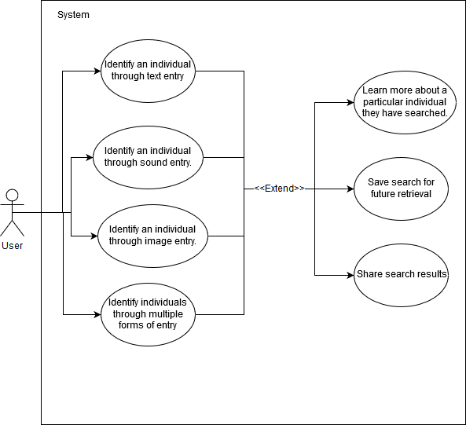
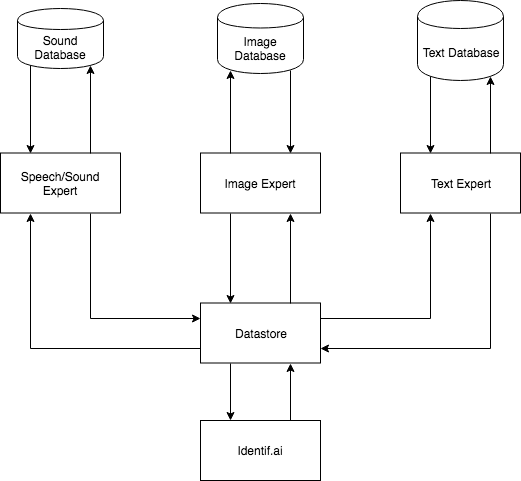
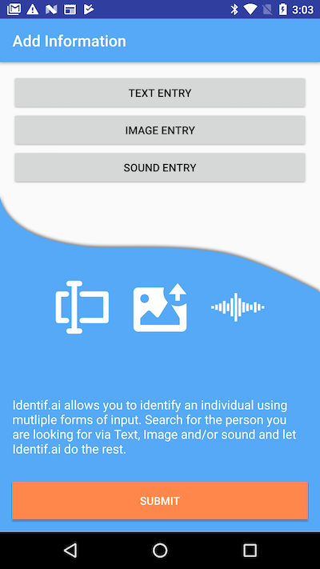

# Identif.ai
Identif.ai is a mobile application that identifies television and movie celebrities. When a user wants to identify an unknown celebrity, they simply need to input a picture, an audio clip, and/or a small description into the application. The application will then take these three inputs and provide the user with information about the celebrity.

## Documentation
- [Software Requirements Specification](https://github.com/itsAlexNguyen/Identif.ai/blob/master/docs/software_requirements_specs.pdf)
- [High Level Design](https://github.com/itsAlexNguyen/Identif.ai/blob/master/docs/high_level_design.pdf)
- [Detailed Design](https://github.com/itsAlexNguyen/Identif.ai/blob/master/docs/detailed_design.pdf)

## Use Case Diagram

## Architecture Diagram

## Screenshots
### Entry Flow
       

### Description Entry
  

### Image Entry
  

### Audio Entry
  

### Saved Searches
   

### Sharing 
    
